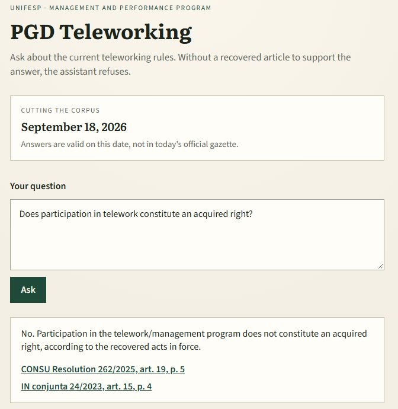
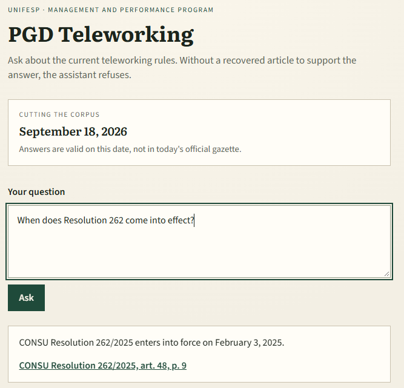
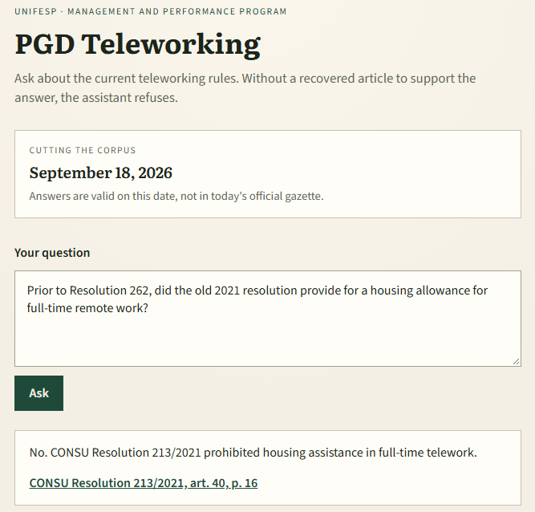
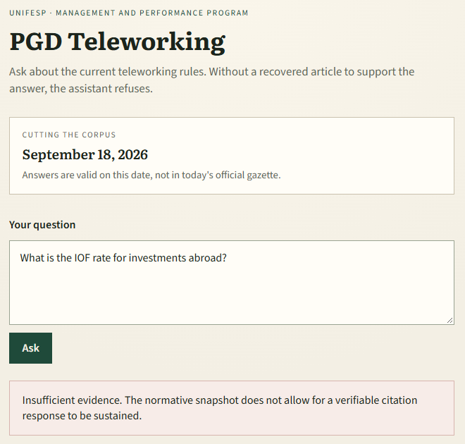
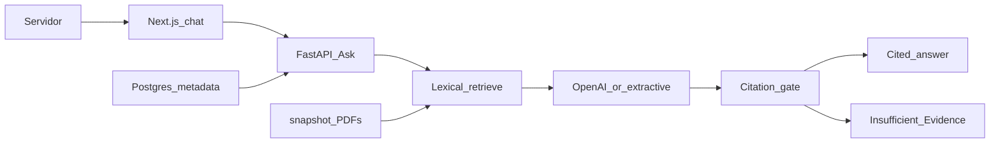
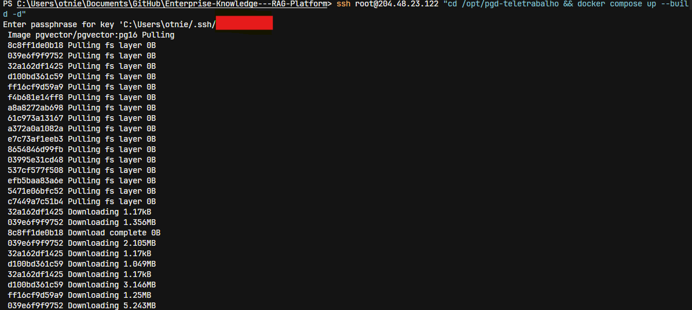
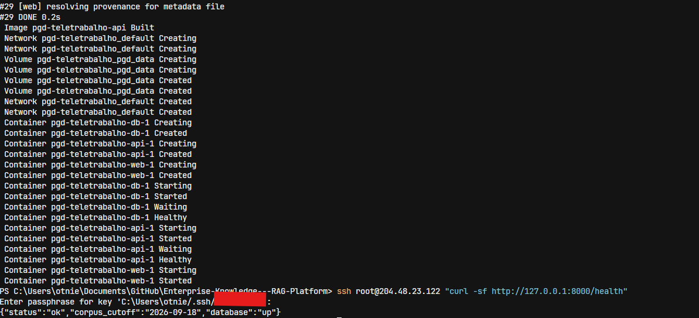
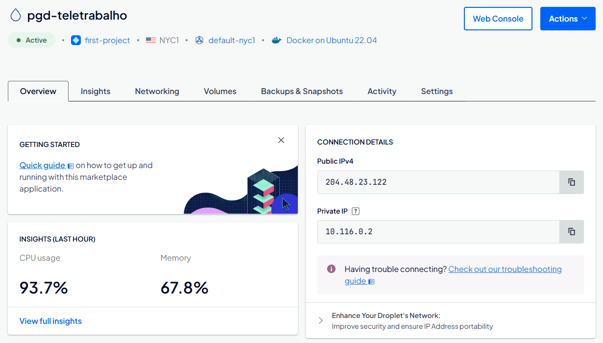
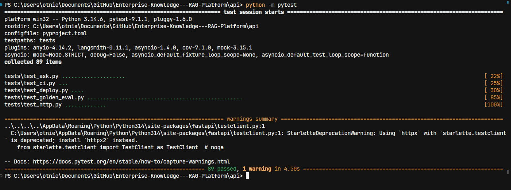

# PGD Teletrabalho

**Language:** English · [Português (Brasil)](README.pt-BR.md)

[](https://github.com/OtnielGomes/Enterprise-Knowledge---RAG-Platform/actions/workflows/ask-quality.yml)


[](LICENSE)

[Overview](#overview) · [Features](#features) · [How it answers](#how-it-answers) · [Corpus](#corpus) · [Data sources](#data-sources) · [Architecture](#architecture) · [Getting started](#getting-started) · [Deploy](#deploy-on-digitalocean) · [Tests](#tests) · [Endpoints](#endpoints)

A Unifesp assistant for **PGD Teletrabalho**: a technical-administrative **Servidor** asks about currently effective telework rules and receives a cited answer from a dated snapshot of numbered **Normative Acts** — or an explicit **Insufficient Evidence** refusal.

> [!IMPORTANT]
> v1 is not a generic enterprise RAG platform. The repository name is leftover from an earlier framing. The product is this case: one corpus, one Ask seam, checkable Citations. Leave, reimbursement, contracts, FAQ, PDF upload, live gazette crawl, login, and dashboards are out of v1.

## Overview

The assistant knows five numbered acts copied into [`snapshot/`](snapshot/), with a **Corpus Cutoff** of **18 September 2026**. Answers are true as of that date, not as of today's official gazette.

**Ask** is the only product seam: a question in, a cited answer or Insufficient Evidence out. The pipeline is fixed — retrieve, draft, then a deterministic citation gate. It is not a tool-using agent loop.

The same [`compose.yaml`](compose.yaml) runs locally and on a DigitalOcean droplet: FastAPI owns Ask, Next.js is a single chat shell, PostgreSQL holds retrieval metadata, and the PDFs ship in the API image.

> [!NOTE]
> The running chat UI is **Portuguese (pt-BR) only**. Screenshots in this README are English documentation of the same flows.

## Features

- **Dated snapshot, not live law** — five PDFs plus [`snapshot/manifest.json`](snapshot/manifest.json); the cutoff is shown in the UI.
- **Cited answers** — every claim that survives the gate points to an Article a human can open at a PDF page.
- **Insufficient Evidence** — one refusal state when retrieved Articles cannot support an answer, or the question is outside the PGD telework slice.
- **Current vs Historical** — default Ask uses Current acts; Resolução CONSU 213/2021 is retrieved only for a Historical Question.
- **Amendments stay separate** — IN conjunta 21/2024 amends IN conjunta 24/2023; Ask does not invent a consolidated text.
- **One Compose file** — local `docker compose up` is the droplet runtime. No MinIO, Redis, App Platform, or Kubernetes in v1.

## How it answers

### Current rule

A question about a rule in force is answered from Current acts, with a Citation the Servidor can check.



### Current and temporal

Questions about when an act entered into force are still Current-slice questions. The cutoff is the snapshot date, not “today”.



### Historical

A Historical Question (for example “before 262” or “the old 2021 resolution”) is the only case in which the superseded Resolução CONSU 213/2021 may be cited. Default Ask never treats 213 as Current.



### Insufficient Evidence

Questions outside the snapshot (tax rates, other HR topics, or claims the retrieved Articles cannot support) are refused. The assistant does not guess.



## Corpus

| Normative Act | Status | Role in v1 |
| --- | --- | --- |
| Resolução CONSU 262/2025 | Current | Unifesp telework regulation in force |
| Decreto 11.072/2022 | Current | Federal PGD framework |
| IN conjunta 24/2023 | Current | Federal instruction |
| IN conjunta 21/2024 | Current | **Amendment** of IN 24 — both remain Current |
| Resolução CONSU 213/2021 | Superseded | Distinct act linked to 262 by **Supersession**; Historical Questions only |

> [!IMPORTANT]
> Answers are valid on the Corpus Cutoff (**2026-09-18**), not in today's official gazette. The snapshot is frozen on purpose so a demo is reproducible. Live crawling is out of v1.

213 and 262 keep different numbers; they are not versions of one document. IN 21 does not replace IN 24. If both IN 24 and IN 21 are retrieved, Ask refuses to synthesize a winner and still returns Citations for both acts. When Unifesp and federal acts both speak, both Citations can appear.

### Data sources

The corpus is **real, public law** — not a synthetic knowledge base. Each PDF in [`snapshot/`](snapshot/) was copied on **18 September 2026** from the official Unifesp CONSU archive or from the Brazilian federal gazette / Planalto. Ask never invents acts; Citations open these same files.

| Normative Act | Official source |
| --- | --- |
| Resolução CONSU 262/2025 | [Unifesp CONSU — resolução_262.pdf](https://site.unifesp.br/conselhos/images/docs/consu/resolucoes/2025/resolucao_262.pdf) |
| Resolução CONSU 213/2021 | [Unifesp CONSU — Resolução_213_Teletrabalho](https://site.unifesp.br/conselhos/images/docs/consu/resolucoes/2021/Resolu%C3%A7%C3%A3o_213_Teletrabalho_13dezembro2021.pdf) |
| Decreto 11.072/2022 | [Planalto — Decreto nº 11.072/2022](https://www.planalto.gov.br/ccivil_03/_ato2019-2022/2022/decreto/d11072.htm) |
| IN conjunta 24/2023 | [DOU — IN conjunta SEGES/SGPRT/MGI nº 24/2023](https://www.in.gov.br/web/dou/-/instrucao-normativa-conjunta-seges-sgprt-/mgi-n-24-de-28-de-julho-de-2023-499593248) |
| IN conjunta 21/2024 | [DOU — IN conjunta SEGES/SGP-SRT/MGI nº 21/2024](https://www.in.gov.br/en/web/dou/-/instrucao-normativa-conjunta-seges-sgp-srt/mgi-n-21-de-16-de-julho-de-2024-572617003) |

Checksums and retrieval dates live in [`snapshot/manifest.json`](snapshot/manifest.json). The in-repo copies are the snapshot Ask is allowed to know; later gazette editions are out of scope until the cutoff moves.

## Architecture



1. **Retrieve** — lexical overlap over Articles. Default: Current acts. Historical markers include 213 in the candidate set.
2. **Draft** — OpenAI chat model (`gpt-4o-mini` by default) writes a Portuguese JSON draft, or an extractive draft when `OPENAI_API_KEY` is empty / the call fails.
3. **Gate** — deterministic: keep Citations whose `article_id` was retrieved or whose quote is in the Article text. Fabricated Citations are dropped. If none remain, the response is Insufficient Evidence. There is no LLM-as-judge on the request path.

| Piece | Role |
| --- | --- |
| [`api/`](api/) FastAPI | Ask, snapshot ingest, retrieve, draft, citation gate |
| [`web/`](web/) Next.js 15 | One PT-BR chat shell; proxies Ask and PDFs |
| [`snapshot/`](snapshot/) | Five PDFs + manifest; copied into the API image |
| PostgreSQL 16 + pgvector | Act/Article metadata |

> [!NOTE]
> `EMBEDDING_MODEL` and the pgvector extension are part of the runtime slice. v1 retrieve is **lexical**, not vector search. Clicking a Citation opens the PDF at that page.

## Getting started

You need [Docker](https://docs.docker.com/get-docker/) and a copy of this repository.

1. Copy the environment template and, if you want model-written answers, set a chat key:

   ```bash
   cp .env.example .env
   ```

2. Start the stack from the repo root (Compose file: [`compose.yaml`](compose.yaml)):

   ```bash
   docker compose up --build
   ```

3. Open the chat at [http://localhost:3000](http://localhost:3000). Ask is at [http://127.0.0.1:8000/ask](http://127.0.0.1:8000/ask). Health: [http://127.0.0.1:8000/health](http://127.0.0.1:8000/health).

> [!TIP]
> With an empty `OPENAI_API_KEY`, Ask still indexes the snapshot and answers with the extractive draft. Retrieval and the citation gate do not depend on the chat model.

### Environment

| Variable | Role |
| --- | --- |
| `OPENAI_API_KEY` | Chat draft. Empty → extractive draft |
| `CHAT_MODEL` | Default `gpt-4o-mini` |
| `EMBEDDING_MODEL` | Default `text-embedding-3-small` (configured; retrieve is lexical) |
| `CORPUS_CUTOFF` | Fallback cutoff (`YYYY-MM-DD`); the UI prefers `snapshot/manifest.json` |
| `WEB_ORIGIN` | Chat origin for CORS. Local default `http://localhost:3000`; on a droplet `http://<ip>:3000` |

Do not commit a real API key. Compose binds Postgres (`5432`) and Ask (`8000`) to localhost; only the chat port **3000** is published on all interfaces.

### API and chat without Compose

```bash
cd api
python -m pip install -e ".[dev]"
uvicorn ask.http:app --reload --port 8000
```

```bash
cd web
npm ci
ASK_API_URL=http://localhost:8000 npm run dev
```

## Deploy on DigitalOcean

The droplet runs this same `compose.yaml` — not App Platform, Kubernetes, or a second architecture. Secrets stay in `.env` on the server, not in the image or in git. Postgres and Ask listen on localhost; the chat is port 3000 (firewall: TCP 22 and 3000).

From Git Bash or WSL, in the repo root:

```bash
bash scripts/deploy-droplet.sh
```

The wizard walks through a Docker 1-Click Droplet, copies the repo over SSH, writes the remote `.env`, and runs `docker compose up --build`. The Corpus Cutoff on `/health` must match `snapshot/manifest.json`.

**Start of deploy** — SSH into the droplet and pull/build the stack:



**End of deploy** — `db`, `api`, and `web` healthy; `/health` reports `status: ok`, cutoff `2026-09-18`, and `database: up`:



**Droplet** — DigitalOcean overview of the running `pgd-teletrabalho` instance:



After deploy, open `http://<droplet-ip>:3000`. An easy Current Teletrabalho question should return a checkable Citation; an unsupported question should return Insufficient Evidence.

## Tests

Quality is the annotator-owned **Golden Set** scored **through Ask**, not traces, RAGAS, or an LLM judge. `pytest` in `api/` collected **89 tests** and passed all of them (extractive draft, empty `OPENAI_API_KEY`):



From `api/`:

```bash
python -m pip install -e ".[dev]"
pytest
```

[`api/tests/conftest.py`](api/tests/conftest.py) forces `OPENAI_API_KEY=""` so local pytest matches CI: retrieve + extractive draft + gate, never a live chat call. Tests hit Ask (in-process and HTTP). They do not inspect SQL or parser internals.

### What the 89 tests cover

**[`test_ask.py`](api/tests/test_ask.py)** — in-process Ask pipeline.

- Blank questions are rejected; the Corpus Cutoff is always on the response.
- The citation gate **keeps** a Citation that matches a retrieved Article and **drops** one whose Article was not retrieved (fabricated citations cannot leak).
- Easy Current questions cite Resolução 262 (participation is not an acquired right), Decreto 11.072 (PGD is not a right of the Servidor), IN 24 (partial vs integral telework), and IN 21 (it revokes selected IN 24 priority items).
- When Unifesp and federal acts both speak, both Citations survive; Ask does not pick a silent winner.
- When IN 24 and IN 21 both speak, Ask refuses to synthesize a consolidated rule and still returns Citations for both.
- Leave-duration and other out-of-slice questions return Insufficient Evidence.
- Historical questions may cite Resolução 213/2021; a default Current question must not.

**[`test_http.py`](api/tests/test_http.py)** — FastAPI `TestClient`.

- `POST /ask` for Current, Historical, amendment-conflict, blank, and unanswerable questions.
- `GET /snapshot/{filename}` serves the indexed PDFs so a Citation is checkable.
- Request logs include duration, status, and whether the drafter was extractive (including when a chat-model call falls back).

**[`test_golden_eval.py`](api/tests/test_golden_eval.py)** — one pytest case **per Golden Set item**, plus eval-contract tests.

The Portuguese set in [`eval/golden_set.json`](eval/golden_set.json) has **43 items**, cutoff `2026-09-18`, owned by a human annotator (not a model-written gabarito). Scoring uses expected Normative Act, expected Article, and `must_abstain`. Default items **fail** if they treat Resolução 213/2021 as Current. Conflict items **fail** if Ask hides one of the acts. A fabricated Citation fails even when the prose looks right. `--require-openai` is refused when the chat key is empty.

| Category | Items | What it proves |
| --- | ---: | --- |
| `easy` | 13 | Straight Current-slice questions (acquired right, housing allowance, extra hours, foreign residence caps, …) |
| `temporal_current` | 7 | Dates and vigour of Current acts (when 262 entered into force, …) |
| `historical` | 5 | Pre-262 / 213-era rules; 213 may be cited |
| `unanswerable` | 8 | Out of slice or unsupported — must abstain |
| `amendment_conflict` | 4 | IN 24 vs IN 21; no silent consolidation |
| `chefia` | 6 | Extra questions from the manager's angle; no approval workflow in v1 |

Run the same scorer outside pytest:

```bash
python -m ask.golden_eval
```

With a chat key present, that command uses the OpenAI draft; without one, the extractive draft. One score, two drafts. Pass `--require-openai` to refuse a keyless run.

**[`test_ci.py`](api/tests/test_ci.py)** — the GitHub Actions file is the quality gate.

- Workflow [`.github/workflows/ask-quality.yml`](.github/workflows/ask-quality.yml) runs on `pull_request` and `push` to `main`.
- Job **Ask pytest**: Python 3.12, `pip install -e ".[dev]"`, `pytest`, `OPENAI_API_KEY: ""`.
- Job **Chat typecheck**: Node 20, `npm ci`, `npm run typecheck` in `web/` (no `next build`, no Compose in CI).
- No OpenAI secret, no Langfuse, no RAGAS, no OpenTelemetry, no droplet SSH.

**[`test_deploy.py`](api/tests/test_deploy.py)** — the Compose contract.

- Only port 3000 is published on all interfaces; 5432 and 8000 bind to `127.0.0.1`.
- The only Compose file is `compose.yaml`; no MinIO or Redis.
- `OPENAI_API_KEY` is an env substitution, never baked into Dockerfiles or committed in `.env.example`.
- `snapshot/` contains exactly the five act PDFs.

### CI

A green check means the Golden Set still passes through Ask with the extractive draft, and the chat shell typechecks. It does not mean traces look good. Langfuse is not required. Reproduce a red check with the same commands locally; there is no second CI-mirror script.

```bash
cd web && npm ci && npm run typecheck
```

## Endpoints

**Ask (FastAPI)**

| Method | Path | Purpose |
| --- | --- | --- |
| `POST` | `/ask` | Body `{ "question": "..." }` → status, message, citations, `corpus_cutoff` |
| `GET` | `/health` | `{ "status", "corpus_cutoff", "database" }` |
| `GET` | `/snapshot/{filename}` | PDF for a Citation page |

**Chat (Next.js BFF)**

| Method | Path | Purpose |
| --- | --- | --- |
| `POST` | `/api/ask` | Proxy to `{ASK_API_URL}/ask` |
| `GET` | `/snapshot/[filename]` | Proxy PDF so the browser stays on the chat origin |
