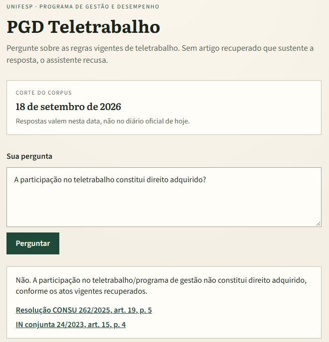
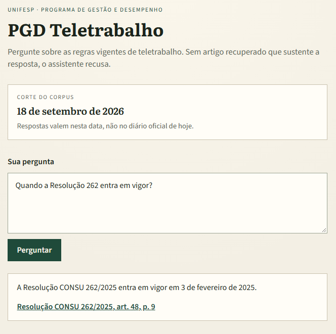
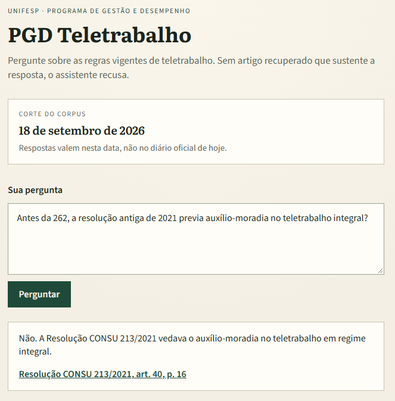
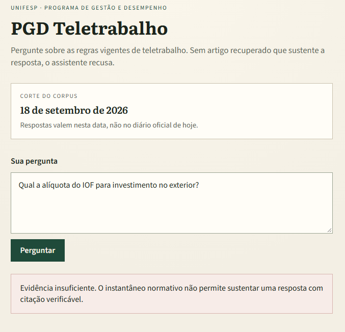
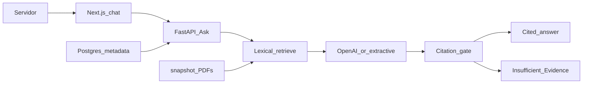

# PGD Teletrabalho

**Idioma:** [English](README.md) · Português (Brasil)

[](https://github.com/OtnielGomes/Enterprise-Knowledge---RAG-Platform/actions/workflows/ask-quality.yml)


[](LICENSE)

[Visão geral](#visão-geral) · [Funcionalidades](#funcionalidades) · [Como responde](#como-responde) · [Corpus](#corpus) · [Fontes dos dados](#fontes-dos-dados) · [Arquitetura](#arquitetura) · [Primeiros passos](#primeiros-passos) · [Deploy](#deploy-na-digitalocean) · [Testes](#testes) · [Endpoints](#endpoints)

Assistente da Unifesp para o **PGD Teletrabalho**: um **Servidor** técnico-administrativo pergunta sobre as regras vigentes de teletrabalho e recebe uma resposta citada a partir de um snapshot datado de **atos normativos** numerados — ou uma recusa explícita de **evidência insuficiente**.

> [!IMPORTANT]
> A v1 não é uma plataforma RAG empresarial genérica. O nome do repositório é resíduo de um recorte anterior. O produto é este caso: um corpus, uma costura Ask, Citações conferíveis. Férias, reembolso, contratos, FAQ, upload de PDF, crawl ao vivo do diário oficial, login e painéis ficam fora da v1.

## Visão geral

O assistente conhece cinco atos numerados copiados em [`snapshot/`](snapshot/), com **corte do corpus** em **18 de setembro de 2026**. As respostas valem nessa data, não no diário oficial de hoje.

**Ask** é a única costura de produto: pergunta entra, resposta citada ou evidência insuficiente sai. O pipeline é fixo — recuperar, redigir, depois um gate determinístico de citação. Não é um laço de agente com ferramentas.

O mesmo [`compose.yaml`](compose.yaml) roda localmente e no droplet da DigitalOcean: FastAPI é dono do Ask, Next.js é um único chat, PostgreSQL guarda metadados de recuperação, e os PDFs entram na imagem da API.

> [!NOTE]
> A interface em execução é **somente português (pt-BR)**. As prints deste README documentam os mesmos fluxos no idioma da aplicação.

## Funcionalidades

- **Snapshot datado, não lei ao vivo** — cinco PDFs mais [`snapshot/manifest.json`](snapshot/manifest.json); o corte aparece na interface.
- **Respostas citadas** — toda afirmação que passa no gate aponta para um Artigo que um humano abre na página do PDF.
- **Evidência insuficiente** — um único estado de recusa quando os Artigos recuperados não sustentam a resposta, ou a pergunta está fora do recorte de PGD Teletrabalho.
- **Vigente vs histórico** — o Ask padrão usa atos Current; a Resolução CONSU 213/2021 só entra numa pergunta histórica.
- **Alterações ficam separadas** — a IN conjunta 21/2024 altera a IN conjunta 24/2023; o Ask não inventa um texto consolidado.
- **Um único Compose** — o `docker compose up` local é o runtime do droplet. Sem MinIO, Redis, App Platform ou Kubernetes na v1.

## Como responde

### Regra vigente

Uma pergunta sobre regra em vigor é respondida com atos Current e uma Citação que o Servidor pode conferir.



### Vigente e temporal

Perguntas sobre quando um ato entra em vigor continuam no recorte Current. O corte é a data do snapshot, não “hoje”.



### Históricas

Uma pergunta histórica (por exemplo “antes da 262” ou “a resolução antiga de 2021”) é o único caso em que a Resolução CONSU 213/2021, já revogada, pode ser citada. O Ask padrão nunca trata a 213 como vigente.



### Sem evidências

Perguntas fora do snapshot (alíquotas de IOF, outros temas de RH, ou afirmações que os Artigos recuperados não sustentam) são recusadas. O assistente não inventa.



## Corpus

| Ato normativo | Status | Papel na v1 |
| --- | --- | --- |
| Resolução CONSU 262/2025 | Current | Regulamento Unifesp de teletrabalho em vigor |
| Decreto 11.072/2022 | Current | Marco federal do PGD |
| IN conjunta 24/2023 | Current | Instrução normativa federal |
| IN conjunta 21/2024 | Current | **Alteração** da IN 24 — as duas permanecem Current |
| Resolução CONSU 213/2021 | Superseded | Ato distinto ligado à 262 por **revogação/substituição**; só pergunta histórica |

> [!IMPORTANT]
> As respostas valem no corte do corpus (**2026-09-18**), não no diário oficial de hoje. O snapshot está congelado de propósito para o demo ser reproduzível. Crawl ao vivo fica fora da v1.

213 e 262 mantêm números diferentes; não são versões de um mesmo documento. A IN 21 não substitui a IN 24. Se as duas são recuperadas, o Ask recusa sintetizar um vencedor e ainda devolve Citações dos dois atos. Quando atos Unifesp e federais falam juntos, as duas Citações podem aparecer.

### Fontes dos dados

O corpus é **norma real e pública** — não é uma base sintética. Cada PDF em [`snapshot/`](snapshot/) foi copiado em **18 de setembro de 2026** do arquivo oficial do CONSU da Unifesp ou do Diário Oficial da União / Planalto. O Ask não inventa atos; as Citações abrem esses mesmos arquivos.

| Ato normativo | Fonte oficial |
| --- | --- |
| Resolução CONSU 262/2025 | [Unifesp CONSU — resolução_262.pdf](https://site.unifesp.br/conselhos/images/docs/consu/resolucoes/2025/resolucao_262.pdf) |
| Resolução CONSU 213/2021 | [Unifesp CONSU — Resolução_213_Teletrabalho](https://site.unifesp.br/conselhos/images/docs/consu/resolucoes/2021/Resolu%C3%A7%C3%A3o_213_Teletrabalho_13dezembro2021.pdf) |
| Decreto 11.072/2022 | [Planalto — Decreto nº 11.072/2022](https://www.planalto.gov.br/ccivil_03/_ato2019-2022/2022/decreto/d11072.htm) |
| IN conjunta 24/2023 | [DOU — IN conjunta SEGES/SGPRT/MGI nº 24/2023](https://www.in.gov.br/web/dou/-/instrucao-normativa-conjunta-seges-sgprt-/mgi-n-24-de-28-de-julho-de-2023-499593248) |
| IN conjunta 21/2024 | [DOU — IN conjunta SEGES/SGP-SRT/MGI nº 21/2024](https://www.in.gov.br/en/web/dou/-/instrucao-normativa-conjunta-seges-sgp-srt/mgi-n-21-de-16-de-julho-de-2024-572617003) |

Checksums e datas de coleta estão em [`snapshot/manifest.json`](snapshot/manifest.json). As cópias no repositório são o snapshot que o Ask pode conhecer; edições posteriores do diário oficial ficam fora do recorte até o corte avançar.

## Arquitetura



1. **Retrieve** — sobreposição lexical sobre Artigos. Padrão: atos Current. Marcadores históricos incluem a 213 no conjunto candidato.
2. **Draft** — o modelo de chat OpenAI (`gpt-4o-mini` por padrão) redige um rascunho JSON em português, ou um rascunho extrativo quando `OPENAI_API_KEY` está vazia / a chamada falha.
3. **Gate** — determinístico: mantém Citações cujo `article_id` foi recuperado ou cujo trecho está no texto do Artigo. Citações fabricadas caem. Se nenhuma resta, a resposta é evidência insuficiente. Não há LLM-as-judge no caminho da requisição.

| Peça | Papel |
| --- | --- |
| [`api/`](api/) FastAPI | Ask, ingestão do snapshot, retrieve, draft, gate de citação |
| [`web/`](web/) Next.js 15 | Um chat PT-BR; faz proxy do Ask e dos PDFs |
| [`snapshot/`](snapshot/) | Cinco PDFs + manifesto; copiados para a imagem da API |
| PostgreSQL 16 + pgvector | Metadados de atos/artigos |

> [!NOTE]
> `EMBEDDING_MODEL` e a extensão pgvector fazem parte do recorte de runtime. O retrieve da v1 é **lexical**, não busca vetorial. Clicar numa Citação abre o PDF naquela página.

## Primeiros passos

É preciso [Docker](https://docs.docker.com/get-docker/) e uma cópia deste repositório.

1. Copie o modelo de ambiente e, se quiser respostas redigidas pelo modelo, defina a chave de chat:

   ```bash
   cp .env.example .env
   ```

2. Suba o stack na raiz do repositório (arquivo Compose: [`compose.yaml`](compose.yaml)):

   ```bash
   docker compose up --build
   ```

3. Abra o chat em [http://localhost:3000](http://localhost:3000). O Ask está em [http://127.0.0.1:8000/ask](http://127.0.0.1:8000/ask). Saúde: [http://127.0.0.1:8000/health](http://127.0.0.1:8000/health).

> [!TIP]
> Com `OPENAI_API_KEY` vazia, o Ask ainda indexa o snapshot e responde com o rascunho extrativo. A recuperação e o gate de citação não dependem do modelo de chat.

### Ambiente

| Variável | Papel |
| --- | --- |
| `OPENAI_API_KEY` | Rascunho de chat. Vazia → rascunho extrativo |
| `CHAT_MODEL` | Padrão `gpt-4o-mini` |
| `EMBEDDING_MODEL` | Padrão `text-embedding-3-small` (configurada; o retrieve é lexical) |
| `CORPUS_CUTOFF` | Corte de fallback (`YYYY-MM-DD`); a UI prefere `snapshot/manifest.json` |
| `WEB_ORIGIN` | Origem do chat para CORS. Padrão local `http://localhost:3000`; no droplet `http://<ip>:3000` |

Não faça commit de uma chave real. O Compose prende Postgres (`5432`) e Ask (`8000`) em localhost; só a porta do chat **3000** é publicada em todas as interfaces.

### API e chat sem Compose

```bash
cd api
python -m pip install -e ".[dev]"
uvicorn ask.http:app --reload --port 8000
```

```bash
cd web
npm ci
ASK_API_URL=http://localhost:8000 npm run dev
```

## Deploy na DigitalOcean

O droplet corre este mesmo `compose.yaml` — não App Platform, Kubernetes nem uma segunda arquitetura. Segredos ficam no `.env` do servidor, não na imagem nem no git. Postgres e Ask escutam em localhost; o chat é a porta 3000 (firewall: TCP 22 e 3000).

No Git Bash ou WSL, na raiz do repositório:

```bash
bash scripts/deploy-droplet.sh
```

O assistente percorre um Droplet Docker 1-Click, copia o repositório por SSH, grava o `.env` remoto e executa `docker compose up --build`. O corte do corpus em `/health` precisa coincidir com `snapshot/manifest.json`.

**Início do deploy** — SSH no droplet e build/subida do stack:


**Fim do deploy** — `db`, `api` e `web` saudáveis; `/health` reporta `status: ok`, corte `2026-09-18` e `database: up`:


**Droplet** — visão geral na DigitalOcean da instância `pgd-teletrabalho` em execução:


Depois do deploy, abra `http://<ip-do-droplet>:3000`. Uma pergunta fácil de Teletrabalho vigente deve devolver uma Citação conferível; uma pergunta sem respaldo deve devolver evidência insuficiente.

## Testes

Qualidade é o **Golden Set** anotado por humano, pontuado **através do Ask**, não traces, RAGAS nem juiz LLM. O `pytest` em `api/` coletou **89 testes** e passou em todos (rascunho extrativo, `OPENAI_API_KEY` vazia):


A partir de `api/`:

```bash
python -m pip install -e ".[dev]"
pytest
```

[`api/tests/conftest.py`](api/tests/conftest.py) força `OPENAI_API_KEY=""` para o pytest local espelhar o CI: retrieve + rascunho extrativo + gate, nunca uma chamada de chat ao vivo. Os testes batem no Ask (in-process e HTTP). Não inspecionam SQL nem o interior do parser.

### O que os 89 testes cobrem

**[`test_ask.py`](api/tests/test_ask.py)** — pipeline Ask in-process.

- Perguntas em branco são rejeitadas; o corte do corpus sempre vai na resposta.
- O gate de citação **mantém** uma Citação que casa com um Artigo recuperado e **descarta** uma cujo Artigo não estava no conjunto (citações fabricadas não vazam).
- Perguntas Current fáceis citam a Resolução 262 (participação não é direito adquirido), o Decreto 11.072 (PGD não é direito do Servidor), a IN 24 (teletrabalho parcial vs integral) e a IN 21 (revoga itens de prioridade da IN 24).
- Quando atos Unifesp e federais falam juntos, as duas Citações sobrevivem; o Ask não escolhe um vencedor silencioso.
- Quando IN 24 e IN 21 falam juntas, o Ask recusa sintetizar uma regra consolidada e ainda devolve Citações das duas.
- Duração de férias e outras perguntas fora do recorte devolvem evidência insuficiente.
- Perguntas históricas podem citar a Resolução 213/2021; uma pergunta Current padrão não pode.

**[`test_http.py`](api/tests/test_http.py)** — `TestClient` do FastAPI.

- `POST /ask` para perguntas Current, históricas, conflito de alteração, em branco e sem resposta.
- `GET /snapshot/{filename}` serve os PDFs indexados para a Citação ser conferível.
- Os logs da requisição incluem duração, status e se o redator foi extrativo (inclusive quando a chamada ao modelo de chat cai no fallback).

**[`test_golden_eval.py`](api/tests/test_golden_eval.py)** — um caso pytest **por item do Golden Set**, mais testes de contrato da avaliação.

O conjunto em português em [`eval/golden_set.json`](eval/golden_set.json) tem **43 itens**, corte `2026-09-18`, de autoria humana (não é gabarito escrito por modelo). A pontuação usa ato normativo esperado, Artigo esperado e `must_abstain`. Itens padrão **falham** se tratarem a Resolução 213/2021 como vigente. Itens de conflito **falham** se o Ask esconder um dos atos. Uma Citação fabricada falha mesmo quando a prosa parece correta. `--require-openai` é recusado quando a chave de chat está vazia.

| Categoria | Itens | O que prova |
| --- | ---: | --- |
| `easy` | 13 | Perguntas diretas do recorte Current (direito adquirido, auxílio-moradia, horas extras, teto de residência no exterior, …) |
| `temporal_current` | 7 | Datas e vigência de atos Current (quando a 262 entra em vigor, …) |
| `historical` | 5 | Regras pré-262 / era 213; a 213 pode ser citada |
| `unanswerable` | 8 | Fora do recorte ou sem respaldo — deve abster |
| `amendment_conflict` | 4 | IN 24 vs IN 21; sem consolidação silenciosa |
| `chefia` | 6 | Perguntas extras no ângulo da chefia; sem fluxo de aprovação na v1 |

O mesmo avaliador fora do pytest:

```bash
python -m ask.golden_eval
```

Com chave de chat, o comando usa o rascunho OpenAI; sem chave, o rascunho extrativo. Uma pontuação, dois redatores. Passe `--require-openai` para recusar uma execução sem chave.

**[`test_ci.py`](api/tests/test_ci.py)** — o arquivo do GitHub Actions é o portão de qualidade.

- O workflow [`.github/workflows/ask-quality.yml`](.github/workflows/ask-quality.yml) roda em `pull_request` e `push` para `main`.
- Job **Ask pytest**: Python 3.12, `pip install -e ".[dev]"`, `pytest`, `OPENAI_API_KEY: ""`.
- Job **Chat typecheck**: Node 20, `npm ci`, `npm run typecheck` em `web/` (sem `next build`, sem Compose no CI).
- Sem secret OpenAI, sem Langfuse, sem RAGAS, sem OpenTelemetry, sem SSH no droplet.

**[`test_deploy.py`](api/tests/test_deploy.py)** — o contrato do Compose.

- Só a porta 3000 é publicada em todas as interfaces; 5432 e 8000 prendem em `127.0.0.1`.
- O único arquivo Compose é `compose.yaml`; sem MinIO nem Redis.
- `OPENAI_API_KEY` é substituição de ambiente, nunca gravada nos Dockerfiles nem commitada em `.env.example`.
- `snapshot/` contém exatamente os cinco PDFs dos atos.

### CI

Um check verde significa que o Golden Set ainda passa pelo Ask com o rascunho extrativo, e o chat typechecka. Não significa que traces “estão bonitos”. Langfuse não é exigido. Reproduza um check vermelho com os mesmos comandos localmente; não há um segundo script-espelho de CI.

```bash
cd web && npm ci && npm run typecheck
```

## Endpoints

**Ask (FastAPI)**

| Método | Caminho | Função |
| --- | --- | --- |
| `POST` | `/ask` | Body `{ "question": "..." }` → status, message, citations, `corpus_cutoff` |
| `GET` | `/health` | `{ "status", "corpus_cutoff", "database" }` |
| `GET` | `/snapshot/{filename}` | PDF da página citada |

**Chat (BFF Next.js)**

| Método | Caminho | Função |
| --- | --- | --- |
| `POST` | `/api/ask` | Proxy para `{ASK_API_URL}/ask` |
| `GET` | `/snapshot/[filename]` | Proxy do PDF para o browser permanecer na origem do chat |
